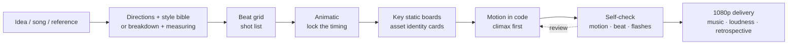

<div align="center">

# 🎬 S17 Motion Art · s17-motion-art

**PV motion in code: from an idea or a song to an editable Remotion project and a 1080p film, or a 1:1 rebuild of a reference video with your own content.**

A Claude Code skill. Kinetic type, transitions, camera moves and rhythm are all written in code; AI only makes still assets (characters, props, plates) when you need them.

[](LICENSE)
[](https://code.claude.com/docs/en/skills)
[](https://www.remotion.dev/)
English · [中文](README.md)


<sub>Clips from a 36-second PV made with this pipeline (57 shots, 8 acts), showing rebuild mode: the shot structure, rhythm and the effect compositions in the second half (wedge type, shards, white finale) were rebuilt 1:1 from a commercial PV as a study; characters, names and copy are original, the character art is AI-generated, and all motion is code.</sub>

</div>

---

## ✨ Four modes

| Mode | You give it | It makes |
|---|---|---|
| **create** | a line, a world or a song | three contrasting creative directions → style bible → beat-cut shot list → animatic → film |
| **realize** | your characters, props and scenes | an identity card per asset (including a three-panel character sheet prompt); every generated still is checked against it so nothing drifts |
| **rebuild** | a reference video | cuts, colours and motion measured, then structure and rhythm rebuilt 1:1 with original content |
| **deliver** | the finished project | chunked 1080p render, music swap without re-rendering, loudness, automatic QA, retrospective |

**The core is "measure it, write it as code":**
- `motion_fit.py` turns the motion of an element in a reference into Remotion `interpolate` easing or `spring` parameters you can paste; perspective fly-ins are fitted in depth, and moves held on twos are detected.
- `beat_check.py` measures a track's tempo grid and checks whether the cuts land on its accents.
- `film_scan.py` finds freezes, black and flash frames the reference doesn't have, and shots that are stiller or busier than the reference.

## 📊 The ledger of one real project

A 36-second game collaboration PV (57 shots, 8 acts), delivered in 1080p:

| | Measured |
|---|---|
| Wall clock / active | 66.7 h / 18.8 h (active includes time the agents worked alone) |
| User messages | 113 (44 with screenshots) |
| Model turns / output tokens | 11,467 / 13.4 M (Opus main loop; sub-agents later all on Sonnet) |
| AI generation (mostly stills) | 121 images + 9 clips = 1,184 Jimeng credits (derived from generation counts) |
| Wasted | 5 of 9 AI clips unused → which is why motion is now always code and AI only makes stills |

Full write-up: [`references/case-study-gamepv.md`](references/case-study-gamepv.md).


## 🚀 Install

Claude Code, for all your projects (works in bash and PowerShell):

```bash
git clone https://github.com/saikizhou-cyber/s17-motion-art.git "$HOME/.claude/skills/s17-motion-art"
```

For one project only: clone into `.claude/skills/s17-motion-art` inside it. Then type `/s17-motion-art`, or just say "make me a PV" or "rebuild this video 1:1"; the skill loads automatically.

Other coding agents that read the Agent Skills format (`SKILL.md`): put the folder in their skills directory (not individually tested).

**Requirements**: Node.js 18+, [ffmpeg](https://ffmpeg.org/) (with ffprobe), Python 3.10+ (`python -m pip install pillow numpy scipy`; `python3` on macOS/Linux). Optional: [rembg](https://github.com/danielgatis/rembg) for cutouts (own virtual env recommended), the Jimeng (即梦) canvas CLI or any image generator (stills only).

- Commands in the docs are written for a POSIX shell; on Windows use Git Bash.
- The tools assume **16:9, 30 fps, a 1280×720 composition named `PV`**. Conform other references first: `ffmpeg -i in.mp4 -vf fps=30,scale=1280:720 -an reference.mp4`.

## 💬 Usage

```text
/s17-motion-art Make a 30-second PV: an MC battle on a late-night radio show, starring my original
character (sheet in ./oc.md), music ./track.wav. Give me three creative directions first, then a shot list
and an animatic for the one I pick.
```

```text
/s17-motion-art Rebuild the shot structure and rhythm of ./reference.mp4 1:1, with the characters
from ./cards/ and a logo of our own.
```

During the build:

```text
Measure the fly-in title at reference frames 785–805 and give me the Remotion code.
S30 to S33 show the same character: keep size and position identical.
Swap the music for ./my-music.wav without re-rendering, and check the cuts still land on the beat.
Scan the render for freezes and flashes the reference doesn't have.
```

It is **not** one-click: you approve the direction, the animatic and the key static boards; the final quality depends on your standards and the number of review rounds.

## 🧭 Workflow



Seven rules (details in [`SKILL.md`](SKILL.md)):

1. Motion is code, and deterministic; AI makes still assets only.
2. Original content only: never generate, cut out, trace or imitate characters, logos, wordmarks, UI skins, signature props, graphic outlines, lyrics or music.
3. Still before motion: approve the direction, animatic and key static boards before animating; build the climax first.
4. Measure, don't eyeball: frames, moves, music and the render each have a measuring tool; one set of placement numbers per figure across consecutive shots.
5. Builders don't judge their own work: sub-agents build on a mid-tier model; critics see only the render, compare two versions in both orders, and every accepted fix comes with before/after frames.
6. Budget before spending.
7. Nothing is "done" until it is verified.

## 🧰 Toolbox (`scripts/`)

| Job | Scripts |
|---|---|
| Measure | `frame_measure.py` (frame grab, colours, blobs, bbox, IoU) · `motion_fit.py` (a move → Remotion easing/spring code) · `cut_detect.py` (cuts + numbered review sheets) |
| Compare with a reference | `compare.py` · `shotsheet.py` · `grid.py` · `strip.py` · `side-by-side.mjs` (local only) |
| Music and timing | `beat_check.py` (tempo grid; cuts vs accents) · `audio_offset.py` (A/V sync) · `animatic.py` (boards + music → rough cut) |
| Still assets | `cutout.py` · `cleanedge.py` · `bluekey.py` · `hairfix.py` · `irisglow.py` · `jm.py` · `jimeng_batch_run.py` · `jimeng_video_run.py` |
| Render and QA | `render-chunks.mjs` (chunks, join, music swap, loudness) · `film_scan.py` (freezes, black, flashes, per-shot motion vs reference) |
| Retrospective | `transcript_stats.py` (time, messages, per-model tokens) |

Every command is in [`references/pipeline-recipes.md`](references/pipeline-recipes.md).

## 🧠 Lessons that cost the most

- **"Looks similar" is not 1:1**; early shots kept being rejected. → moves are now measured with `motion_fit.py` instead of tuning easing by eye.
- **The same character changed size across three consecutive shots**; four rounds of fixes. → one shared constant.
- **AI clips with the wrong pose or a cropped figure**: 5 of 9 wasted. → motion moved to code; AI makes stills only.
- **A 14-agent parallel build hit the usage limit and returned nothing.** → batches that persist to disk.
- **The full render froze at frame 725.** → chunks; segments are silent, so new music is a 5-second remux.
- **A shot silently froze for almost a second and nobody noticed in per-shot review.** → `film_scan.py` finds it.
- **Our own brand lockup borrowed the original logo's construction.** → before publishing, check every lockup, badge and effect shape for lookalikes.

## ❓ FAQ

**Do I need to code?** The AI writes the code. You need to install Node and ffmpeg and give feedback on comparison boards and the animatic.

**Do I need Jimeng?** No. AI is only used for still assets and any image generator works; if you have your own art, no AI is needed at all.

**Can I rebuild a video with copyrighted characters?** You can study its shot structure and rhythm for learning or private research; characters, logos/wordmarks, UI styles, lyrics, music and traced graphics must all be original. Renaming is not a way around infringement; assess the risk yourself before publishing. The skill refuses to generate, cut out, trace or imitate protected content.

**How long and how much?** See the ledger. Pure code-motion shots cost no credits; shots with character art cost per still. Claude usage comes on top: this project used 13.4 M output tokens and hit the usage limit 5 times, so start with a few shots.

**Is Remotion free?** Free (commercial use included) for individuals, for-profit companies with up to 3 employees and non-profits; larger companies need a company license. See the [Remotion license](https://www.remotion.dev/license).

## 📁 Layout

```text
s17-motion-art/
├── SKILL.md                      # entry point: four modes, seven rules, tool table
├── references/
│   ├── create.md                 # create: directions, style bible, beat shot list, animatic, anti-AI-look rules
│   ├── asset-cards.md            # realize: character/prop/scene identity cards and prompt templates
│   ├── rebuild.md                # rebuild: breakdown, measuring, per-shot comparison
│   ├── deliver.md                # deliver: render, music, QA, bundle, retrospective
│   ├── pipeline-recipes.md       # every command
│   └── case-study-gamepv.md      # the real project: time, tokens, credits, pitfalls
├── scripts/                      # 22 tools + shared module _shots.py
├── assets/                       # README demo media
└── THIRD_PARTY_NOTICES.md        # third-party code licences
```

## ⚖️ Originality and copyright

- This repository contains the method, the tools and demo media; it contains no frames, music or characters from any reference video. It is not affiliated with, authorised or endorsed by the rights holders of any game, anime or brand.
- The demo is a study of a commercial PV's shot structure and effect compositions; characters, names and copy are original, and the images are AI-generated.
- Composition, rhythm, logos/wordmarks, UI styles and traced shapes may still be protected by copyright, trademark or unfair-competition law: redesign all of them, never trace, and never use the original music. Assess the risk before publishing or commercial use, and get permission where needed. Not legal advice.
- Files in `assets/` are demo media for this project and are not covered by the MIT licence.

## 📄 License

Code and docs: [MIT](LICENSE) (except `assets/`). The cut rule in `scripts/cut_detect.py` is ported from zenstory-ai/video-recap-skills (MIT); see [`THIRD_PARTY_NOTICES.md`](THIRD_PARTY_NOTICES.md). Remotion, rembg, ffmpeg and generation services have their own licenses and terms.

---

<div align="center">
If this skill helps you, a ⭐ helps others find it. Share what you made in an Issue.
</div>
