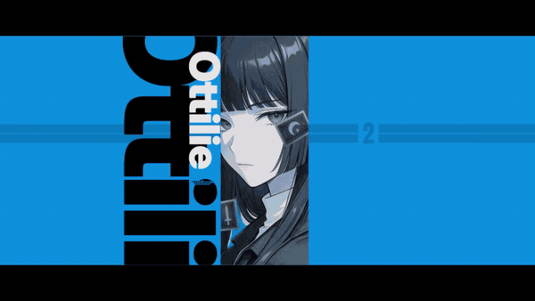
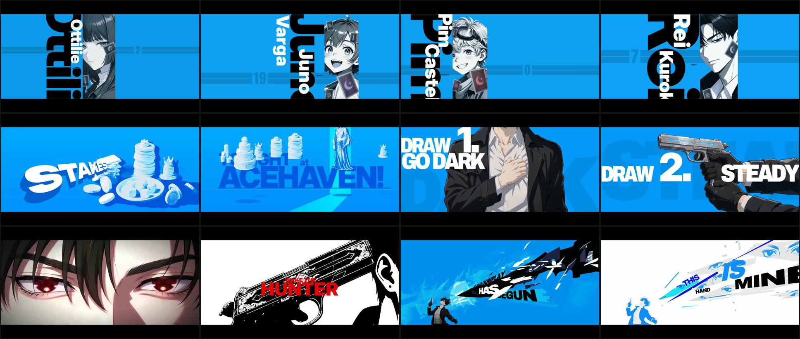
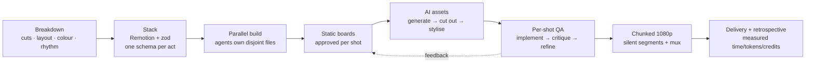

<div align="center">

# 🎬 reference-video-rebuild

**Rebuild a reference video's shot structure, motion and layout 1:1 as an editable code project, with your own characters, copy and art.**

A Claude Code skill for the whole pipeline: shot breakdown → measuring → parallel multi-agent build → AI-generated assets → shot-by-shot comparison with the original → 1080p render → measured retrospective.

[](LICENSE)
[](https://code.claude.com/docs/en/skills)
[](https://www.remotion.dev/)
English · [中文](README.md)



<sub>Clips from a 36-second PV made with this pipeline (57 shots, 8 acts). Shot structure and rhythm were studied from a commercial PV; characters, names and copy are original, and the character art is AI-generated.</sub>

</div>

---

## ✨ What it does

- **Copies the structure, not the content.** Measures every shot of a game PV, trailer or motion-graphics piece (composition, position, size, colour, camera, rhythm) and rebuilds it in code; characters, text, logos, UI and graphics on screen are your own designs.
- **Delivers an editable project, not just a video.** Built on [Remotion](https://www.remotion.dev/) (React + TypeScript): one folder and one config schema per act; swapping a character is one config edit.
- **Uses AI for what code draws badly.** Props, cards, character poses and short clips are generated, cut out, keyed and stylised in code into each shot's palette.
- **Accepts by numbers, not by feel.** Every shot is compared side by side with the original; tools measure position, size, angle and colour.
- **Ships and looks back.** Chunked 1080p rendering; music swaps without re-rendering; time, messages and per-model tokens counted from the session transcripts.

## 📊 The ledger of one real project

A 36-second game collaboration PV (57 shots, 8 acts), delivered in 1080p:

| | Measured |
|---|---|
| Wall clock / active | 66.7 h / 18.8 h (active includes time the agents worked alone) |
| User messages | 113 (44 with screenshots) |
| Model turns / output tokens | 11,467 / 13.4 M (Opus main loop; sub-agents later all on Sonnet) |
| AI generation | 121 images + 9 clips = 1,184 Jimeng credits (derived from generation counts) |
| Wasted | 5 of 9 clips unused (120 credits) plus a 9-image batch replaced by a redesign (72): ≥ 192 credits (~16%) → hence the rule "approve the still before the video" |

Full write-up: [`references/case-study-gamepv.md`](references/case-study-gamepv.md).



## 🚀 Install

Claude Code, for all your projects (works in bash and PowerShell):

```bash
git clone https://github.com/saikizhou-cyber/reference-video-rebuild.git "$HOME/.claude/skills/reference-video-rebuild"
```

For one project only: clone into `.claude/skills/reference-video-rebuild` inside it. Then type `/reference-video-rebuild` in Claude Code, or just say "rebuild this video 1:1"; the skill loads automatically.

Other coding agents that read the Agent Skills format (`SKILL.md`): put the folder in their skills directory (not individually tested).

**Requirements**

| Required | Optional |
|---|---|
| Node.js 18+, [ffmpeg](https://ffmpeg.org/) (with ffprobe) | [rembg](https://github.com/danielgatis/rembg) for cutouts (own virtual env recommended) |
| Python 3.10+: `python -m pip install pillow numpy scipy` (`python3` on macOS/Linux) | Jimeng (即梦) canvas CLI, or any image/video generator you can use |

- Commands in the docs are written for a POSIX shell; on Windows use Git Bash.
- The tools assume **16:9, 30 fps, a 1280×720 composition named `PV`**. Conform other references first: `ffmpeg -i in.mp4 -vf fps=30,scale=1280:720 -an reference.mp4`.

## 💬 Usage

Put the reference video in your project folder and tell Claude Code:

```text
/reference-video-rebuild Rebuild the shot structure and rhythm of ./reference.mp4 1:1. Replace the characters
with my original character (sheet in ./oc.md), brand name NOVA with our own logo. Show me a static comparison
board per shot before animating. AI generation budget: 500 credits.
```

During the build:

```text
The figure in shot 12 is larger than the original and too far right. Measure the original and fix it.
S30 to S33 show the same character: keep size and position identical.
Match the bullet trace's position, size and angle to reference frame 942, with a shape of our own.
Swap the music for ./my-music.wav without re-rendering.
Write a retrospective with measured time, tokens and credits.
```

It is **not** one-click: you approve each shot, log into your own generator account and set the budget; the final quality depends on your standards and the number of review rounds.

## 🧭 Workflow



Seven rules (details in [`SKILL.md`](SKILL.md)):

1. The original is the judge: measure, don't eyeball.
2. Original content only: never generate, cut out, trace or imitate characters, logos, wordmarks, UI skins, signature props, graphic outlines, lyrics or music; "1:1" applies to layout, size, timing and palette only. Never feed the original's frames to a generator.
3. Still first, then motion and video.
4. Sub-agents get an explicit mid-tier model (Sonnet); key judgement stays with the main model.
5. Announce the budget before generating; report spend as measured from files.
6. One set of placement numbers per figure across consecutive shots.
7. Nothing is "done" until it is verified.

## 🧰 Toolbox (`scripts/`)

| Script | Purpose |
|---|---|
| `compare.py` | render chosen frames and pair them with the same reference frames |
| `shotsheet.py` / `grid.py` / `strip.py` | per-shot sheet / whole film at a glance / frame strip of one move |
| `side-by-side.mjs` | original \| ours video for timing (local only) |
| `frame_measure.py` | frame grab, modal colours, blobs, edge runs, figure bbox, IoU |
| `cutout.py` / `cleanedge.py` / `bluekey.py` | cutout, de-halo and speck removal, flat-backdrop key |
| `hairfix.py` / `irisglow.py` | case-specific examples: pull drifted dark hair back from orange-brown in AI clips; light a red iris as the eyes open (adjust the hue/threshold constants for other characters) |
| `jm.py` / `jimeng_batch_run.py` / `jimeng_video_run.py` | Jimeng CLI: Unicode-safe wrapper, budgeted image and clip batches |
| `render-chunks.mjs` | chunked render, segment continuity check, join with any music |
| `audio_offset.py` | A/V sync check by cross-correlation |
| `transcript_stats.py` | time, messages and per-model tokens from Claude Code transcripts |

Every command is in [`references/pipeline-recipes.md`](references/pipeline-recipes.md).

## 🧠 Lessons that cost the most

- **A 14-agent parallel build hit the usage limit and returned nothing.** → batches that persist to disk.
- **"Looks similar" is not 1:1**; early shots kept being rejected. → full-resolution side-by-side, measured.
- **The same character changed size across three consecutive shots**; four rounds of fixes. → one shared constant.
- **AI clips with the wrong pose or a cropped figure**: 5 of 9 wasted. → approve the still first; a grey stick-figure guide for exact poses.
- **0.35x playback stutters.** → `ffmpeg minterpolate` optical flow.
- **The full render froze at frame 725.** → chunks; segments are silent, so new music is a 5-second remux.
- **Our own brand lockup borrowed the original logo's construction** (pixel glyphs, stencil line, bevelled slab). → before publishing, check every lockup, badge and effect shape for lookalikes.
- **The retrospective missed 36 messages**: screenshot messages are stored differently in transcripts. → `transcript_stats.py`.

## ❓ FAQ

**Do I need Jimeng?** No. The pipeline only requires "our own still as input, motion described in words". Jimeng scripts are included; any generator works the same way.

**Can I rebuild a video with copyrighted characters?** You can study its shot structure and rhythm for learning or private research; characters, logos/wordmarks, UI styles, lyrics, music and traced graphics must all be original. Renaming is not a way around infringement; assess the risk yourself before publishing. The skill refuses to generate, cut out, trace or imitate protected content.

**Do I need to code?** The AI writes the code. You need to install Node and ffmpeg and give feedback on comparison boards.

**How long and how much?** See the ledger: 36 s / 57 shots took ~19 active hours and 1,184 credits. Fewer shots cost less; approving stills first saves most of the wasted clip credits. Claude usage comes on top: this project used 13.4 M output tokens (~2.56 B cache-read) and hit the usage limit 5 times, so start with a few shots.

**Is Remotion free?** Free (commercial use included) for individuals, for-profit companies with up to 3 employees and non-profits; larger companies need a company license. See the [Remotion license](https://www.remotion.dev/license).

## 📁 Layout

```text
reference-video-rebuild/
├── SKILL.md                      # the skill: rules, workflow, checklist, pitfalls
├── references/
│   ├── pipeline-recipes.md       # commands for every step
│   └── case-study-gamepv.md      # the real project: time, tokens, credits, pitfalls
├── scripts/                      # 17 tools + shared module _shots.py
└── assets/                       # README demo media
```

## ⚖️ Originality and copyright

- This repository contains the method, the tools and demo media; it contains no frames, music or characters from any reference video. It is not affiliated with, authorised or endorsed by the rights holders of any game, anime or brand.
- The demo is a study of a commercial PV's shot structure; characters, names and copy are original, and the images are AI-generated.
- Composition, rhythm, logos/wordmarks, UI styles and traced shapes may still be protected by copyright, trademark or unfair-competition law: redesign all of them, never trace, and never use the original music. Assess the risk before publishing or commercial use, and get permission where needed. Not legal advice.
- Files in `assets/` are demo media for this project and are not covered by the MIT licence.

## 📄 License

Code and docs: [MIT](LICENSE) (except `assets/`). Remotion, rembg, ffmpeg and generation services have their own licenses and terms.

---

<div align="center">
If this skill helps you, a ⭐ helps others find it. Share what you rebuilt in an Issue.
</div>
