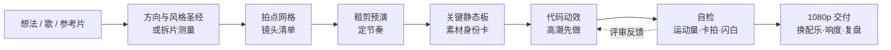

<div align="center">

# 🎬 S17 艺术动效 · s17-motion-art

**用代码做 PV 动效：从一个想法、一首歌，到可编辑的 Remotion 工程和 1080p 成片；也能把一条参考片 1:1 复刻成你自己的内容。**

一个给 Claude Code 用的 Skill。动态字、转场、镜头运动、节奏全部用代码写；AI 只在需要时出静态素材（角色、道具、底图）。

[](LICENSE)
[](https://code.claude.com/docs/en/skills)
[](https://www.remotion.dev/)
[English](README.en.md) · 中文


<sub>上图是用这套流程做出来的 36 秒 PV 片段（57 个镜头、8 幕），演示的是复刻模式：镜头结构、节奏和后半段的特效构图（楔形字、碎片、白色结尾）按一条商业 PV 1:1 学习复刻；角色、名字、文案为原创，角色图由 AI 生成，所有动效由代码实现。</sub>

</div>

---

## ✨ 四种模式

| 模式 | 你给它 | 它做出 |
|---|---|---|
| **创意 create** | 一句话、一个世界观或一首歌 | 三个对比鲜明的创意方向 → 风格圣经 → 按拍点切好的镜头清单 → 粗剪预演 → 成片 |
| **还原 realize** | 你的角色、道具、场景 | 每个素材一张"身份卡"（含三栏角色设定图提示词），出图自动对照，不走样 |
| **复刻 rebuild** | 一条参考视频 | 切点、配色、运动全部量出来，用原创内容 1:1 重建结构和节奏 |
| **交付 deliver** | 做好的工程 | 分段渲染 1080p、换配乐不重渲、响度标准化、自动质检、复盘 |

**它的核心是"量出来，写成代码"：**
- `motion_fit.py` 把参考片里一个元素的运动，直接反推成能贴进 Remotion 的 `interpolate` 缓动或 `spring` 弹簧参数，透视飞入按深度拟合，还能看出"一拍二"。
- `beat_check.py` 测音乐的拍点网格，检查切点是否落在重音上。
- `film_scan.py` 扫出成片里原片没有的静止、黑帧、闪白，以及比原片"更死"或"更躁"的镜头。

## 📊 一次真实项目的账本

用这套流程复刻一条 36 秒的游戏联动 PV（57 镜头、8 幕），最终交付 1080p：

| 项目 | 实测 |
|---|---|
| 全程 / 活跃时间 | 66.7 小时 / 18.8 小时（活跃时间含 AI 自己跑的时间） |
| 用户发的消息 | 113 条（44 条带截图） |
| 模型轮数 / 输出 token | 11,467 轮 / 1,342 万（主控 Opus，子代理后期全部改用 Sonnet） |
| AI 生成（静态素材为主） | 121 张图 + 9 段视频 = 1,184 即梦积分（按生成数反推） |
| 白花的 | 9 段 AI 视频里 5 段没用上 → 所以现在动效一律用代码做，AI 只出静态图 |

完整复盘见 [`references/case-study-gamepv.md`](references/case-study-gamepv.md)。


## 🚀 安装

Claude Code 个人级（所有项目可用，bash 和 PowerShell 都能用）：

```bash
git clone https://github.com/saikizhou-cyber/s17-motion-art.git "$HOME/.claude/skills/s17-motion-art"
```

只给某个项目用：clone 到项目里的 `.claude/skills/s17-motion-art`。装好后输入 `/s17-motion-art`，或者直接说"帮我做一条 PV""1 比 1 复刻这条视频"，它会自动加载。

**依赖**：Node.js 18+、[ffmpeg](https://ffmpeg.org/)（含 ffprobe）、Python 3.10+（`python -m pip install pillow numpy scipy`）。可选：[rembg](https://github.com/danielgatis/rembg)（抠图，建议单独建虚拟环境）、即梦画布 CLI 或任何图片生成工具（只用来出静态素材）。

- 文档里的命令按 POSIX shell 写，Windows 请用 Git Bash。
- 工具默认按 **16:9、30fps、1280×720、合成名 `PV`** 工作。

## 💬 怎么用

```text
/s17-motion-art 帮我做一条 30 秒的 PV：深夜电台里的 MC 对决，主角是我的原创角色（设定在 ./oc.md），
配乐 ./track.wav。先给我三个创意方向，选定后出镜头清单和粗剪预演。
```

```text
/s17-motion-art 1:1 复刻 ./reference.mp4 的镜头结构和节奏，角色换成 ./cards/ 里的角色卡，Logo 自己设计。
```

过程中可以这样说：

```text
量一下原片第 785–805 帧那个飞入字的运动，直接给我 Remotion 代码
S30 到 S33 是同一个人物，前后大小位置要一致
把配乐换成 ./my-music.wav，不要重渲，并检查切点还卡不卡拍
扫一下成片，有没有原片没有的静止和闪白
```

它**不是**一键出片：方向、粗剪、关键静态板都要你点头，最终质量取决于你的要求和返工轮数。

## 🧭 流程



七条铁律（详见 [`SKILL.md`](SKILL.md)）：

1. 动效就是代码，且逐帧确定；AI 只出静态素材。
2. 只做原创：角色、Logo、字标、界面、标志性道具、图形轮廓、歌词音乐都不生成、不抠、不描、不模仿。
3. 先静后动：方向、粗剪、关键静态板确认后才写动效；高潮先做。
4. 量出来，不目测：画面、运动、音乐、成片都有测量工具；同一人物跨镜头只用一组位置参数。
5. 做的人不评自己：子代理用中档模型干活，评审只看成片、两版对比交换顺序、修改附前后对比图。
6. 花钱之前先报预算。
7. 没验证就不说"完成"。

## 🧰 工具箱（`scripts/`）

| 用途 | 脚本 |
|---|---|
| 测量 | `frame_measure.py`（抽帧、取色、色块、外框、IoU）· `motion_fit.py`（运动 → Remotion 缓动/弹簧代码）· `cut_detect.py`（自动切点 + 带帧号复核图） |
| 和参考片对照 | `compare.py` · `shotsheet.py` · `grid.py` · `strip.py` · `side-by-side.mjs`（只在本地看） |
| 音乐与节奏 | `beat_check.py`（拍点网格、切点卡拍检查）· `audio_offset.py`（音画同步）· `animatic.py`（静态板 + 音乐 → 粗剪预演） |
| 静态素材 | `cutout.py` · `cleanedge.py` · `bluekey.py` · `hairfix.py` · `irisglow.py` · `jm.py` · `jimeng_batch_run.py` · `jimeng_video_run.py` |
| 渲染与质检 | `render-chunks.mjs`（分段渲染、拼接、换配乐、响度）· `film_scan.py`（静止、黑帧、闪白、逐镜头运动量对比） |
| 复盘 | `transcript_stats.py`（用时、消息、各模型 token） |

命令都在 [`references/pipeline-recipes.md`](references/pipeline-recipes.md)。

## 🧠 踩坑精选

- **"神似"不等于 1:1。** 早期镜头被反复退回 → 现在运动用 `motion_fit.py` 量出参数，不再凭眼睛调缓动。
- **同一个人物在相邻三个镜头里忽大忽小**，返工四轮 → 一个共享常量管整段。
- **AI 视频动作不对、人物被裁**，9 段里白做 5 段 → 动效改用代码，AI 只出静态图。
- **14 个代理并行搭建撞上用量上限，结果全空** → 分批，每批独立落盘。
- **整片一次渲染在第 725 帧卡死** → 分段渲染；分段是静音的，换配乐只要 5 秒重新混音。
- **一个镜头悄悄静止了将近 1 秒，逐镜头对照时没人发现** → `film_scan.py` 自动扫出来。
- **自家品牌的字标照着原片 Logo 的造字方式做了** → 公开前逐个检查字标、徽章、特效形状有没有"长得像原作"。

## ❓ 常见问题

**要会写代码吗？** 代码由 AI 写；你需要会装 Node 和 ffmpeg、会看对照图和粗剪提意见。

**必须用即梦吗？** 不用。AI 只用来出静态素材，任何图片生成工具都行；你自己有素材就完全不用 AI。

**能复刻带版权角色的视频吗？** 可以拿它的镜头结构和节奏做学习、个人研究；角色、Logo/字标、界面样式、歌词、音乐和描出来的图形必须全部原创。只换名字不等于规避侵权，公开发布前请自己评估风险。这个 Skill 会拒绝生成、抠图、描摹或模仿受保护的内容。

**要多久、多少钱？** 参考上面的账本。纯代码动效的镜头不花积分；带角色图的镜头按静态图张数估。Claude 用量要单独算：这次用了 1,342 万输出 token，中途 5 次触到用量上限，建议先拿几个镜头小规模试跑。

**Remotion 收费吗？** 个人、3 人以内的营利公司和非营利组织免费（可商用）；超过 3 人的公司需要购买公司许可，以 [Remotion 官方许可](https://www.remotion.dev/license) 为准。

## 📁 目录结构

```text
s17-motion-art/
├── SKILL.md                      # 总入口：四种模式、七条铁律、工具表
├── references/
│   ├── create.md                 # 创意：三方向、风格圣经、拍点分镜、粗剪预演、反 AI 味守则
│   ├── asset-cards.md            # 还原：角色/道具/场景身份卡与提示词模板
│   ├── rebuild.md                # 复刻：拆片、测量、逐镜头对照
│   ├── deliver.md                # 交付：渲染、配乐、质检、打包、复盘
│   ├── pipeline-recipes.md       # 所有命令
│   └── case-study-gamepv.md      # 真实项目复盘
├── scripts/                      # 22 个工具脚本 + 共用模块 _shots.py
├── assets/                       # README 用的演示图
└── THIRD_PARTY_NOTICES.md        # 第三方代码许可
```

## ⚖️ 原创与版权

- 本仓库只包含流程、工具和演示画面，不包含任何参考视频的画面、音乐或原作角色；与任何游戏、动画或品牌的权利人无关联，也未获其授权或背书。
- 演示画面是对一条商业 PV 镜头结构和特效构图的学习性复刻，角色、名字、文案为原创，图像由 AI 生成。
- 镜头构图、节奏、Logo/字标、界面样式和描摹出的图形仍可能受版权、商标或反不正当竞争法保护：这些都要自己重新设计，不要描摹，也不要使用原片音乐。公开发布或商用前请自行评估，必要时取得授权。本文不构成法律意见。
- `assets/` 里的演示图只用于说明本项目，不在 MIT 授权范围内。

## 📄 License

代码与文档：[MIT](LICENSE)（`assets/` 除外）。`scripts/cut_detect.py` 的切点规则移植自 zenstory-ai/video-recap-skills（MIT），许可全文见 [`THIRD_PARTY_NOTICES.md`](THIRD_PARTY_NOTICES.md)。依赖的 Remotion、rembg、ffmpeg 和各家生成服务有各自的许可和条款。

---

<div align="center">
如果这个 Skill 帮到了你，点个 ⭐ 让更多人看到。欢迎提 Issue 分享你做的作品。
</div>
