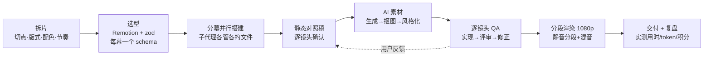

<div align="center">

# 🎬 reference-video-rebuild

**把一条参考视频的镜头结构、动效和排版 1:1 复刻成可编辑的代码工程，角色、文案、美术全部换成你自己的。**

一个给 Claude Code 用的 Skill：拆镜头 → 量参数 → 多代理并行搭建 → AI 生成素材 → 逐镜头对照原片 → 1080p 出片 → 复盘，全流程。

[](LICENSE)
[](https://code.claude.com/docs/en/skills)
[](https://www.remotion.dev/)
[English](README.en.md) · 中文


<sub>上图是用这套流程实际做出来的 36 秒 PV 片段（共 57 个镜头、8 幕）。镜头结构和节奏参照一条商业 PV 学习复刻；角色、名字、文案为原创，角色图由 AI 生成。</sub>

</div>

---

## ✨ 它能帮你做什么

- **复刻结构，不复制内容**：照着一条游戏 PV、预告片或 MG 动画，把每个镜头的构图、位置、大小、配色、运镜和节奏量出来，再用代码重建；画面里的角色、文字、Logo、界面和图形全部自己设计。
- **出一个能改的工程，而不只是一条视频**：基于 [Remotion](https://www.remotion.dev/)（React + TypeScript），每幕一个文件夹、一份配置；换角色只改一个配置文件。
- **代码画不好的交给 AI**：道具、卡牌、角色动作、几秒的小动画用 AI 生成，再抠图、抠色键，在代码里风格化成镜头的配色。
- **用数字验收，不靠感觉**：每个镜头都和原片左右并排比；位置、大小、角度、颜色都有量化工具。
- **能出片，也能复盘**：1080p 分段渲染；换配乐不用重渲；最后用会话记录自动统计用时、消息数、各模型 token。

## 📊 一次真实项目的账本

用这套流程复刻一条 36 秒的游戏联动 PV（57 镜头、8 幕），最终交付 1080p：

| 项目 | 实测 |
|---|---|
| 全程 / 活跃时间 | 66.7 小时 / 18.8 小时（活跃时间含 AI 自己跑的时间） |
| 用户发的消息 | 113 条（44 条带截图） |
| 模型轮数 / 输出 token | 11,467 轮 / 1,342 万（主控 Opus，子代理后期全部改用 Sonnet） |
| AI 生成 | 121 张图 + 9 段视频 = 1,184 即梦积分（按生成数反推） |
| 白花的 | 9 段视频里 5 段没用上（120 积分），加上一批被重新设计替换的 9 张图（72 积分），至少 192 积分（约 16%）→ 所以有了"先定静态图再做视频"这条铁律 |

完整复盘见 [`references/case-study-gamepv.md`](references/case-study-gamepv.md)。


## 🚀 安装

Claude Code 个人级（所有项目可用，bash 和 PowerShell 都能用）：

```bash
git clone https://github.com/saikizhou-cyber/reference-video-rebuild.git "$HOME/.claude/skills/reference-video-rebuild"
```

只给某个项目用：clone 到项目里的 `.claude/skills/reference-video-rebuild`。装好后在 Claude Code 里输入 `/reference-video-rebuild`，或者直接说"1 比 1 复刻这条视频"，它会自动加载。

其他支持 Agent Skills（`SKILL.md`）格式的 AI 编程工具，把整个文件夹放进它们的 skills 目录即可（未逐一测试）。

**依赖**

| 必需 | 可选 |
|---|---|
| Node.js 18+、[ffmpeg](https://ffmpeg.org/)（含 ffprobe） | [rembg](https://github.com/danielgatis/rembg)（抠图，建议单独建虚拟环境） |
| Python 3.10+：`python -m pip install pillow numpy scipy`（macOS/Linux 用 `python3`） | 即梦画布 CLI（或任何你能用的图片 / 视频生成工具） |

- 文档里的命令按 POSIX shell 写，Windows 请用 Git Bash。
- 工具默认按 **16:9、30fps、1280×720、合成名 `PV`** 工作。参考片不是这个规格，先转一下：`ffmpeg -i in.mp4 -vf fps=30,scale=1280:720 -an reference.mp4`。

## 💬 怎么用

把参考视频放进项目文件夹，然后对 Claude Code 说：

```text
/reference-video-rebuild 1:1 复刻 ./reference.mp4 的镜头结构和节奏。角色换成我的原创角色（设定在 ./oc.md），
品牌名 NOVA，Logo 自己设计。每个镜头先出静态对照稿给我确认，AI 生成积分上限 500。
```

做的过程中可以这样用：

```text
第 12 镜头的人物比原片大、位置偏右，量一下原片再改
S30 到 S33 是同一个人物，前后大小位置要一致
这个子弹轨迹的位置、大小、角度对齐原片第 942 帧，形状我们自己设计
把配乐换成 ./my-music.wav，不要重渲
给这次项目做个复盘：用时、token、积分都要实测
```

它**不是**一键出片：每个镜头要你点头，AI 生成要你登录自己的账号、自己定预算，最终质量取决于你的要求和返工轮数。

## 🧭 工作流



七条铁律（详见 [`SKILL.md`](SKILL.md)）：

1. 以原片为准，量出来，不目测。
2. 只做原创：角色、Logo、字标、界面样式、标志性道具、图形轮廓、歌词和音乐都不生成、不抠、不描、不模仿；"1:1" 只对齐布局、大小、时间和配色。也不把原片画面喂给生成器。
3. 先定静态图，再做动效和视频。
4. 子代理一律显式指定中档模型（Sonnet），关键判断留给主模型。
5. 生成前先报预算，花费按文件实测、如实汇报。
6. 同一个人物跨镜头只用一组位置参数。
7. 没验证就不说"完成"。

## 🧰 工具箱（`scripts/`）

| 脚本 | 用途 |
|---|---|
| `compare.py` | 渲染指定帧，和原片同一帧左右拼图 |
| `shotsheet.py` / `grid.py` / `strip.py` | 逐镜头对照表 / 全片一览 / 某段动作的逐帧条 |
| `side-by-side.mjs` | 原片｜成片并排视频，查卡点（只在本地看） |
| `frame_measure.py` | 抽帧、取主色、找色块、量边缘、量人物外框、算重合度 IoU |
| `cutout.py` / `cleanedge.py` / `bluekey.py` | 抠图、去白边和碎块、抠纯色背景 |
| `hairfix.py` / `irisglow.py` | 案例专用示例：把 AI 视频里漂成橙褐色的深色头发拉回来；让红色瞳孔在睁眼时亮起（换角色要改色相和阈值） |
| `jm.py` / `jimeng_batch_run.py` / `jimeng_video_run.py` | 即梦 CLI：中文安全的包装、带预算上限的批量出图 / 出视频 |
| `render-chunks.mjs` | 分段渲染、检查分段连续性、拼接，任意换配乐 |
| `audio_offset.py` | 互相关检查音画同步 |
| `transcript_stats.py` | 从 Claude Code 会话记录统计用时、消息、各模型 token |

常用命令都在 [`references/pipeline-recipes.md`](references/pipeline-recipes.md)。

## 🧠 踩坑精选

- **14 个代理并行搭建，撞上用量上限，结果全空。** → 分批，每批独立落盘。
- **"神似"不等于 1:1。** 早期镜头被反复退回。→ 每个镜头全分辨率并排、量化比对。
- **同一个人物在相邻三个镜头里忽大忽小。** 返工四轮。→ 一个共享常量管整段。
- **AI 视频动作不对、人物被裁。** 9 段里白做 5 段。→ 先确认静态图；要精确姿势就自己画灰色火柴人当参考图。
- **0.35 倍慢放一卡一卡。** → `ffmpeg minterpolate` 光流补帧。
- **整片一次渲染在第 725 帧卡死。** → 分段渲染；分段是静音的，换配乐只要 5 秒重新混音。
- **自家品牌的字标照着原片 Logo 的造字方式做了**（像素字、模板字、斜面色块）。→ 公开前逐个检查字标、徽章、特效形状有没有"长得像原作"。
- **复盘时消息数少算了 36 条**：带截图的消息在会话记录里存法不同。→ `transcript_stats.py`。

## ❓ 常见问题

**必须用即梦吗？** 不用。流程只要求"拿你自己的静态图当输入，动作用文字描述"。即梦脚本是现成的，换成别的生成工具同理。

**能复刻带版权角色的视频吗？** 可以拿它的镜头结构和节奏做学习、个人研究；角色、Logo/字标、界面样式、歌词、音乐和描出来的图形必须全部原创。只换名字不等于规避侵权，公开发布前请自己评估风险。这个 Skill 会拒绝生成、抠图、描摹或模仿受保护的内容。

**不会写代码能用吗？** 代码由 AI 写；你需要会装 Node 和 ffmpeg、会看对照图提意见。愿意逐镜头提意见，就能做出东西。

**要多久、多少钱？** 参考上面的账本：36 秒、57 镜头大约 19 小时活跃时间、1,184 即梦积分。镜头越少越省；先定静态图能省下大部分白花的视频积分。另外 Claude 用量要单独算：这次用了 1,342 万输出 token（约 25.6 亿缓存读取），中途 5 次触到用量上限，建议先拿几个镜头小规模试跑。

**Remotion 收费吗？** 个人、3 人以内的营利公司和非营利组织免费（可商用）；超过 3 人的公司需要购买公司许可，以 [Remotion 官方许可](https://www.remotion.dev/license) 为准。

## 📁 目录结构

```text
reference-video-rebuild/
├── SKILL.md                      # Skill 本体：铁律、流程、检查清单、坑
├── references/
│   ├── pipeline-recipes.md       # 每一步的命令
│   └── case-study-gamepv.md      # 真实项目复盘（用时、token、积分、坑）
├── scripts/                      # 17 个工具脚本 + 共用模块 _shots.py
└── assets/                       # README 用的演示图
```

## ⚖️ 原创与版权

- 本仓库只包含流程、工具和演示画面，不包含任何参考视频的画面、音乐或原作角色；与任何游戏、动画或品牌的权利人无关联，也未获其授权或背书。
- 演示画面是对一条商业 PV 镜头结构的学习性复刻，角色、名字、文案为原创，图像由 AI 生成。
- 镜头构图、节奏、Logo/字标、界面样式和描摹出的图形仍可能受版权、商标或反不正当竞争法保护：这些都要自己重新设计，不要描摹，也不要使用原片音乐。公开发布或商用前请自行评估，必要时取得授权。本文不构成法律意见。
- `assets/` 里的演示图只用于说明本项目，不在 MIT 授权范围内。

## 📄 License

代码与文档：[MIT](LICENSE)（`assets/` 除外）。依赖的 Remotion、rembg、ffmpeg 和各家生成服务有各自的许可和条款。

---

<div align="center">
如果这个 Skill 帮到了你，点个 ⭐ 让更多人看到。欢迎提 Issue 分享你复刻的作品。
</div>
